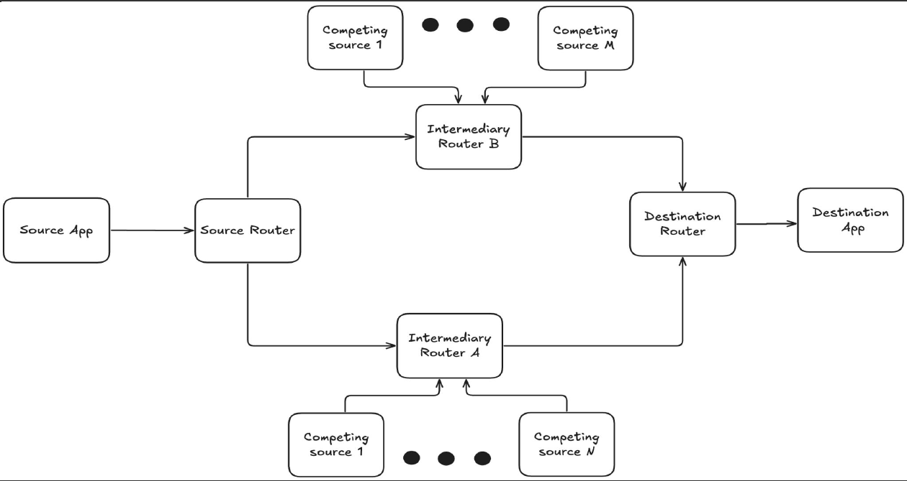
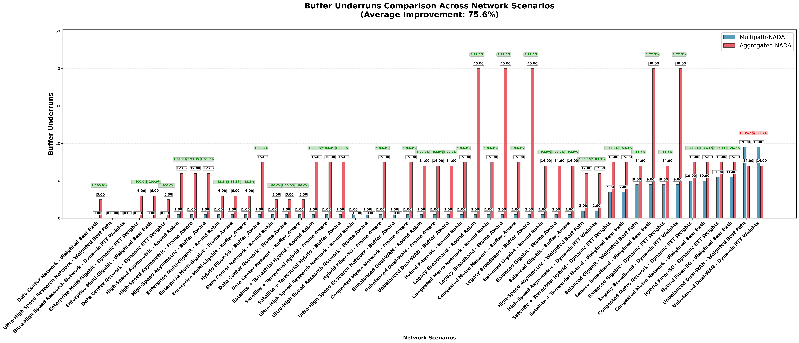
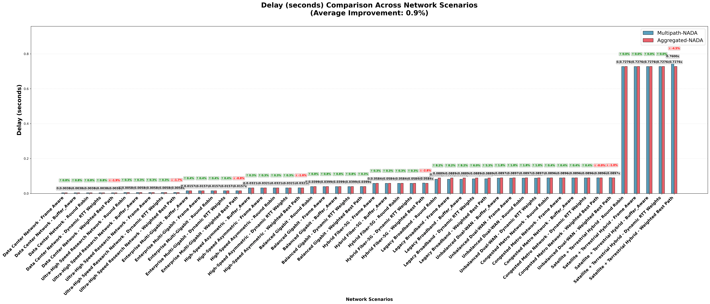
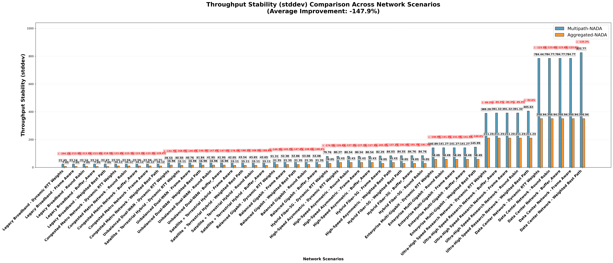

# Dissertation thesis

# Abstract
In a world where the demand for real-time communication is in an ever increasing demand, the need for better performance and lower network costs become imperative in an ever more crowded network space.One of these real-time communication protocols that quickly became a standard for communicating video streams is WebRTC.

Traditionally communication done with this framework uses a single-path approach, which in the current modern network contest can be improved and will certainly beneficiate off of multipath communication. By taking advantage of the fact that modern network setups can easily include multiple communication paths, research in this field becomes a good point of interest for potential improvements such as: improved resilience, enhanced throughput and bandwidth utilization through aggregation, decreased packet loss and potentially lower latency and jitter.

The aim of this research is to dive deeper into the field of multipath communication for the WebRTC environment, in particular for the congestion control required for this kind of communication. In the current landscape, congestion control algorithms such as GCC, SCReAM or NADA, lack multipath capabilities.

This research proposes a novel wrapper architecture over the NADA algorithm, designed to enable traffic distribution over multiple paths using an array of different strategies. The study utilizes a network simulator to experiment with the potential of this approach and evaluate its possible impact on key performance criteria. The  are expected to provide valuable insights into optimizing existing single-path congestion controllers for multipath WebRTC deployments, ultimately contributing to more resilient and high-performing real-time video communication. 

# Topology of the experiments 

## Simulation classes
For creating the UDP wrappers I used a Strategy design pattern 

## Video packets

# Results

